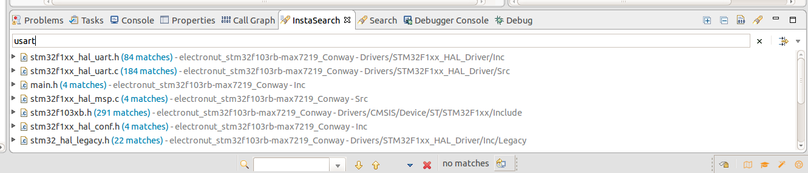
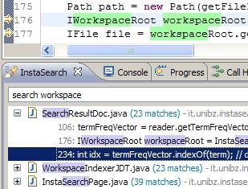

# Eclipse plug-in for quick code search

InstaSearch is an Eclipse IDE plug-in for performing quick and advanced search of workspace files. It indexes files using Lucene and keeps the index up to date automatically. The search is performed instantly as-you-type and resulting files are displayed in an Eclipse view.

Each file then can be previewed using few most matching and relevant lines. A double-click on the match leads to the matching line in the file.

Now Support Eclipse 2024-06 and later, Mac OS X, Linux (with nautilus) and Windows.

## Use  

Once InstaSearch is successfully installed, you'll see a nice little "InstaSearch" search tab appear at the bottom:



You can also click the `Search` menu option at the top --> `InstaSearch...`



Search Tips
---
Lucene [query syntax](http://lucene.apache.org/core/old_versioned_docs/versions/3_0_0/queryparsersyntax.html) can be used for searching. This includes:

* Wildcard searches
  * `app* initialize`
* Excluding words
  * `application -initialize`
* Fuzzy searches to find similar matches
   * `application init~`
* Limit by location - directory, projects or working set
   * `proj:MyProject,OtherProject  application  init `
   * `ws:MyWorkingSet  dir:src  init `
* Limit by filename, extension or modification time
   * `name:app*  ext:java,xml,txt  modified:yesterday  `
* Search by file name initials (e.g. FOS to find FileOutputStream.java)
   * `name:FOS`

To exclude some folders from search indexing, mark them as *Derived* in the folder's properties.
There are also useful [Eclipse Search Tips](https://github.com/ajermakovics/eclipse-instasearch/wiki/Eclipse-search-tips).

**Note**: Fuzzy search is started automatically if no exact matches are found

## Features

* Instantly shows search results
* Shows a preview using relevant lines
* Periodically updates the index
* Matches partial words (e.g. case in CamelCase)
* Opens and highlights matches in files
* Searches JAR source attachments
* Supports filtering by extension/project/working set

## Build

This project uses [Tycho](https://github.com/eclipse-tycho/tycho) with [Maven](https://maven.apache.org/) to build. It requires Maven 3.9.0 or higher version.

Dev build:

```
mvn clean verify
```

Release build:

```
mvn clean org.eclipse.tycho:tycho-versions-plugin:set-version -DnewVersion=2.0.0 verify
```

## Install

1. Add `https://raw.githubusercontent.com/tlcsdm/eclipse-instasearch/master/update_site/` as the upgrade location in Eclipse.
2. Download from [Jenkins](https://jenkins.tlcsdm.com/job/eclipse-plugin/job/eclipse-instasearch)
3. <table style="border: none;">
  <tbody>
    <tr style="border:none;">
      <td style="vertical-align: middle; padding-top: 10px; border: none;">
        <a href='http://marketplace.eclipse.org/marketplace-client-intro?mpc_install=7012266' title='Drag and drop into a running Eclipse Indigo workspace to install eclipse-instasearch'> 
          
        </a>
      </td>
      <td style="vertical-align: middle; text-align: left; border: none;">
        ← Drag it to your eclipse workbench to install! (I recommand Main Toolbar as Drop Target)
      </td>
    </tr>
  </tbody>
</table>
